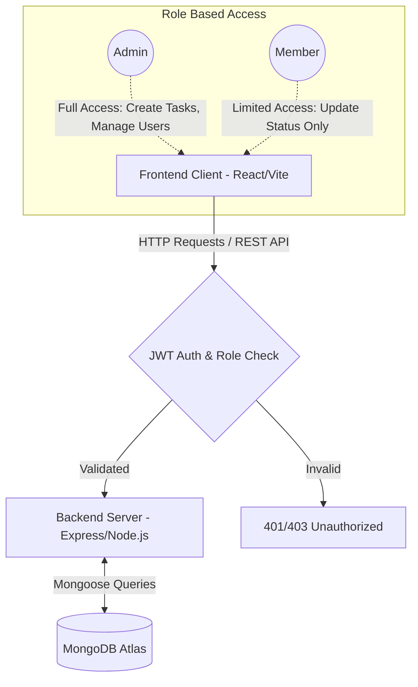

# Ethara Task Manager

A robust, role-based project and task management application built for the **Ethara AI Assignment**. This platform allows administrators to manage workspaces and allocate tasks seamlessly, while team members can track and update their progress in real-time.


## Live Link
https://aware-perfection-production-f0dd.up.railway.app/login

---

## Tech Stack

| Domain | Technologies Used |
| :--- | :--- |
| **Frontend** | React.js, TypeScript, Vite, Tailwind CSS |
| **Backend** | Node.js, Express.js, TypeScript |
| **Database** | MongoDB Atlas, Mongoose |
| **Security** | JSON Web Tokens (JWT), bcrypt (Password Hashing) |
| **Deployment**| Railway (CI/CD automated from GitHub) |

---

## Architecture & System Flow


---

## Key Features & User Flow

### Admin Flow
1. **Secure Registration:** Registers with a specific Admin Secret Key.
2. **Workspace Management:** Can create new Projects/Workspaces.
3. **Task Allocation:** Can assign tasks to specific users, add instructions/comments, and attach files (names).
4. **Team Overview:** Can view all registered team members and their roles.
5. **Global Filtering:** Can filter tasks by all users or specific assignees.

### Member Flow
1. **Standard Registration:** Registers as a standard team member.
2. **Focused View:** Only sees tasks explicitly assigned to them.
3. **Status Tracking:** Can update task status (`Pending` ➡️ `In Progress` ➡️ `Completed`).
4. **Restricted Access:** Cannot create projects, assign tasks, or view other members' workloads.

---

## Database Schema

Here is a brief overview of the core MongoDB collections:

| Collection | Key Fields | Relationships / Logic |
| :--- | :--- | :--- |
| **Users** | `name`, `email`, `password`, `role` | `role` is strictly Enum: `['Admin', 'Member']` |
| **Projects**| `name`, `createdAt` | Acts as a container for grouped tasks. |
| **Tasks** | `title`, `projectId`, `assignedTo`, `status`, `comment`, `attachmentName` | Links to `Project._id` and `User._id` (assignedTo array/reference). |

---

## API Endpoints Summary

| Method | Endpoint | Access | Description |
| :--- | :--- | :--- | :--- |
| `POST` | `/api/auth/register` | Public | Registers a new Admin or Member. |
| `POST` | `/api/auth/login` | Public | Authenticates user and returns JWT. |
| `GET`  | `/api/users` | Admin | Fetches all registered users for task allocation. |
| `POST` | `/api/projects` | Admin | Creates a new workspace/project. |
| `GET`  | `/api/projects` | Both | Fetches available projects. |
| `POST` | `/api/tasks` | Admin | Creates and assigns a new task. |
| `GET`  | `/api/tasks/:projectId`| Both | Fetches tasks (Filtered for members, all for admin). |
| `PUT`  | `/api/tasks/:id` | Both | Updates task status (e.g., to 'Completed'). |

---

## Local Installation & Setup

If you wish to run this project locally, follow these steps:

### Prerequisites
- Node.js installed (v18+)
- A MongoDB URI cluster link

### 1. Backend Setup
```bash
cd backend
npm install
```
Create a `.env` file in the `backend` directory:
```env
PORT=8000
MONGO_URI=your_mongodb_connection_string
JWT_SECRET=your_super_secret_key
ADMIN_SECRET_KEY=gaurav
```
Start the backend server:
```bash
npm run dev
```

### 2. Frontend Setup
Open a new terminal:
```bash
cd frontend
npm install
```
Create a `.env` file in the `frontend` directory:
```env
VITE_API_URL=http://localhost:8000/api
```
Start the frontend development server:
```bash
npm run dev
```

---
*Developed by Gaurav Arya.*
https://www.linkedin.com/in/gaurav-arya-4321041a6/
